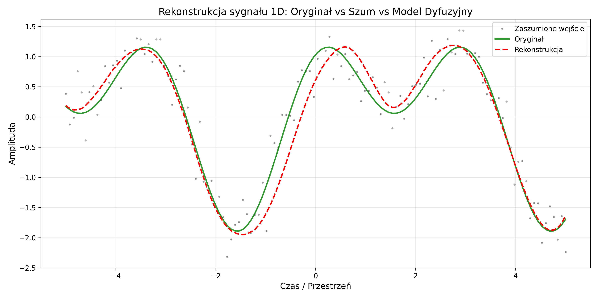

<div align="center">

# ZASTOSOWANIE MODELI DYFUZYJNYCH DO STABILIZACJI WYKRESÓW FUNKCJI


**Autorka:** Klaudia Stodółkiewicz  
**Promotor:** dr inż. Tomasz Służalec

<p align="center">
  
  <br>
  <em>Wizualizacja procesu zaszumiania funkcji 1D.</em>
</p>

</div>

---

## O projekcie

Repozytorium zawiera zbiór eksperymentów i implementacji badających zastosowanie **Probabilistycznych Modeli Dyfuzyjnych (DDPM)** w zadaniach rekonstrukcji sygnałów jednowymiarowych oraz powierzchni dwuwymiarowych.

Głównym celem pracy jest zbadanie skuteczności modeli generatywnych w zadaniu stabilizacji (odszumiania) funkcji matematycznych w porównaniu do metod klasycznych (takich jak filtry Savitzky'ego-Golaya czy Autoenkodery).

---

## Struktura Projektu

Poniższe drzewo przedstawia organizację plików w repozytorium wraz z krótkim opisem zawartości każdego katalogu.

```text
.
├── assets/                           # Grafiki, diagramy i animacje użyte w pliku README
├── konwolucyjny-model-dyfuzyjny/     # Implementacja modelu opartego na CNN 1D (Główny eksperyment)
│   ├── conv1d/                       # Analiza aktywacji warstw wewnętrznych, propagacji sygnału i map ciepła
│   ├── tuning/                       # Zapisane wagi modeli z procesu strojenia hiperparametrów (Grid Search)
│   ├── wyniki_eksperymentu_1/        # Historie treningu i wykresy odszumiania (Eksperyment 1)
│   ├── wyniki_eksperymentu_2/        # Historie treningu i wykresy odszumiania (Eksperyment 2)
│   ├── cnn.ipynb                     # Główny notebook z implementacją CNN 1D i pętlą treningową
│   └── cnn_inne_funkcje.ipynb        # Testy modelu na niestandardowych funkcjach matematycznych
├── konwolucyjny-model-dyfuzyjny-2d/  # Rozszerzenie modelu na powierzchnie 2D (Pola skalarne)
│   ├── checkpoint_func/              # Checkpointy modeli wytrenowanych na konkretnych funkcjach 2D
│   ├── eksperymenty_2d/              # Wygenerowane obrazy rekonstrukcji powierzchni (heatmapy)
│   ├── search_2d/                    # Wyniki poszukiwania najlepszej architektury dla 2D
│   └── cnn2d.ipynb                   # Notebook z implementacją dyfuzji dla obrazów/powierzchni
├── prosty-model-dyfuzyjny/           # Prototyp modelu opartego na sieciach MLP
│   ├── frames/                       # Klatki wygenerowane do stworzenia animacji procesu uczenia
│   └── mlp.ipynb                     # Implementacja "od zera" podstawowego mechanizmu dyfuzji
├── istniejace-narzedzia.ipynb        # Benchmarking metod klasycznych (Savitzky-Golay, Autoencoder)
├── rodzaje-szumu.ipynb               # Teoretyczna analiza i wizualizacja różnych paradygmatów szumu
└── README.md                         # Główna dokumentacja projektu

```

---

## Opis modułów

### 1. Podstawy Teoretyczne i Benchmarking

> Katalog główny

Analiza porównawcza szumu i klasycznych metod filtracji.

* **`rodzaje_szumu.ipynb`**: Wizualizacja szumu dyskretnego, gaussowskiego i dyfuzyjnego (manifold).
* **`istniejace_narzedzia.ipynb`**: Implementacje referencyjne: Filtr Savitzky'ego-Golaya, Procesy Gaussowskie (GP), Splajny, Autoenkoder (AE).

### 2. Konwolucyjny Model Dyfuzyjny (CNN 1D)

> Katalog: `konwolucyjny-model-dyfuzyjny/*`

Główna część badawcza. Wykorzystuje sieci konwolucyjne 1D do zachowania lokalnych zależności w sygnale oraz **Sinusoidal Positional Embeddings**.

* W folderze `conv1d` znajdują się wizualizacje tego, jak sieć "widzi" sygnał wewnątrz swoich warstw ukrytych w zależności od kroku czasu.

<div align="center">

  

  <br><em>Porównanie rekonstrukcji sygnału przez model dyfuzyjny i metody klasyczne.</em>

</div>

### 3. Model Dyfuzyjny 2D (CNN 2D)

> Katalog: `konwolucyjny-model-dyfuzyjny-2d/*`

Rozszerzenie koncepcji na pola skalarne.

* Odszumianie powierzchni matematycznych (np. funkcja siodłowa, fale).
* Folder `eksperymenty_2d` zawiera wizualne porównanie: **Oryginał vs Zaszumiony vs Odszumiony**.

<div align="center">

  

  <br><em>Wizualizacja 3D: Oryginał vs Zaszumiony vs Odszumiony (CNN 2D).</em>

</div>

### 4. Prosty Model Dyfuzyjny (MLP)

> Katalog: `prosty-model-dyfuzyjny/*`

Implementacja dydaktyczna procesu dyfuzji (Forward & Reverse) na prostych danych 1D przy użyciu sieci w pełni połączonej (MLP). Służyła do weryfikacji poprawności algorytmu DDPM.


---

## Koncepcje

W projektach wykorzystano schemat **DDPM**:

1.  **Forward Process ($q$)**: Stopniowe dodawanie szumu Gaussa do danych w $T$ krokach, aż do uzyskania czystego szumu izotropowego $\mathcal{N}(0, I)$.

    $$q(x_t | x_{t-1}) = \mathcal{N}(x_t; \sqrt{1 - \beta_t} x_{t-1}, \beta_t I)$$

2.  **Reverse Process ($p_\theta$)**: Sieć neuronowa uczona jest przewidywać szum $\epsilon_\theta$ dodany w danym kroku $t$, co pozwala na iteracyjne odtwarzanie oryginalnego sygnału.

    $$x_{t-1} = \frac{1}{\sqrt{\alpha_t}} \left( x_t - \frac{1-\alpha_t}{\sqrt{1-\bar{\alpha}_t}} \epsilon_\theta(x_t, t) \right) + \sigma_t z$$

3.  **Time Embeddings**: Istotny element architektury, pozwalający sieci rozróżniać poziom zaszumienia sygnału. Dzięki temu jedna sieć obsługuje zarówno mocno zaszumione (początek generowania), jak i prawie czyste sygnały (finiszowanie).

---


## Wyniki i wnioski

| Metoda | MSE (Błąd średniokwadratowy) | Cechy charakterystyczne |
| :--- | :---: | :--- |
| **Savitzky-Golay** | *do uzupełnienia* | |
| **Autoenkoder (DAE)** |*do uzupełnienia*  | |
| **Model Dyfuzyjny** | *do uzupełnienia*  | |

---

## Wymagania i instalacja

Projekt oparty jest na języku **Python 3.8+**. Zaleca się utworzenie wirtualnego środowiska.

```bash
# Klonowanie repozytorium
git clone [https://github.com/twoj-login/diffusion-models-thesis.git](https://github.com/twoj-login/diffusion-models-thesis.git)
cd diffusion-models-thesis

# Instalacja zależności
pip install torch torchvision numpy matplotlib scipy seaborn pandas tqdm torchinfo

```

---

<div align="center">
<sub>© 2024 Klaudia Stodółkiewicz. Projekt magisterski.</sub>
</div>

